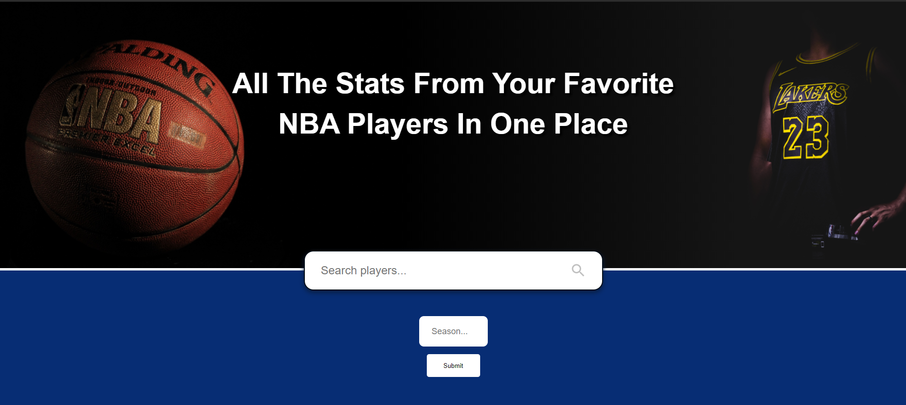

# 🏀 Season Stats 🏀

> A web application that shows you all the seazon stats from NBA Players since 1979.

## Description

Season Stats allows you to search for a specific player that has played in the NBA or is still playing and lets you choose a season from which the stats will be. The stats come from an open source NBA Api (https://www.balldontlie.io/ ).

## Technologies

- HTML
- CSS/SCSS
- Javascript
- React.js
- Material-UI
- API
- Axios
